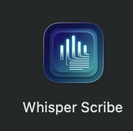

# Whisper Scribe

A fast, lightweight macOS menu bar app that continuously records audio and transcribes it locally using Whisper Large v3 on Apple Silicon GPU. Everything stays on-device — no cloud, no subscriptions.

<p align="center">
  
</p>

<p align="center">
  
</p>

## What It Does

Whisper Scribe sits in your menu bar and records audio in 2-minute segments, transcribing each one with MLX-accelerated Whisper Large v3. Transcriptions are grouped into hourly slots — one card per clock hour — and appended as new segments complete. All text is stored locally in SQLite with full-text search.

## Key Features

- **Always-on recording** with smart pause on screen lock/sleep
- **MLX GPU transcription** via Whisper Large v3 (~2x faster than CPU on M-series chips)
- **Hourly time slots** — clean UI, one card per hour, text grows as you talk
- **Full-text search** with highlighted results
- **Date/time filtering** — filter by day and hour range, copy all matching text
- **Hallucination filtering** — Silero VAD pre-filter + post-processing regex strips repeated phrases and silent-segment artifacts
- **Smart device selection** — auto-prefers built-in mic over Bluetooth to avoid AirPods audio degradation
- **macOS native** — translucent vibrancy, Cmd+, toggle, draggable window

## Tech Stack

Rust (Tauri v2) + SolidJS + MLX Whisper (Python) + SQLite FTS5

## Requirements

- macOS 14+ on Apple Silicon (M1/M2/M3/M4)
- Python 3.11+ (mlx-whisper auto-installs on first run)
- ~3 GB disk for the Whisper Large v3 MLX model (downloads automatically)

## Install

```bash
# Build from source
npm install
cargo tauri build

# The .app and .dmg are in src-tauri/target/release/bundle/
cp -R "src-tauri/target/release/bundle/macos/Whisper Scribe.app" /Applications/
```

## Roadmap

- [ ] Periodic screen capture with local vision models (Qwen3-VL, Gemma 4) for OCR-based activity logging
- [ ] Searchable visual history — what you saw + what you said, correlated by timestamp
- [ ] Multi-monitor screenshot support
- [ ] Speaker diarization (who said what)
- [ ] Export to markdown/JSON
