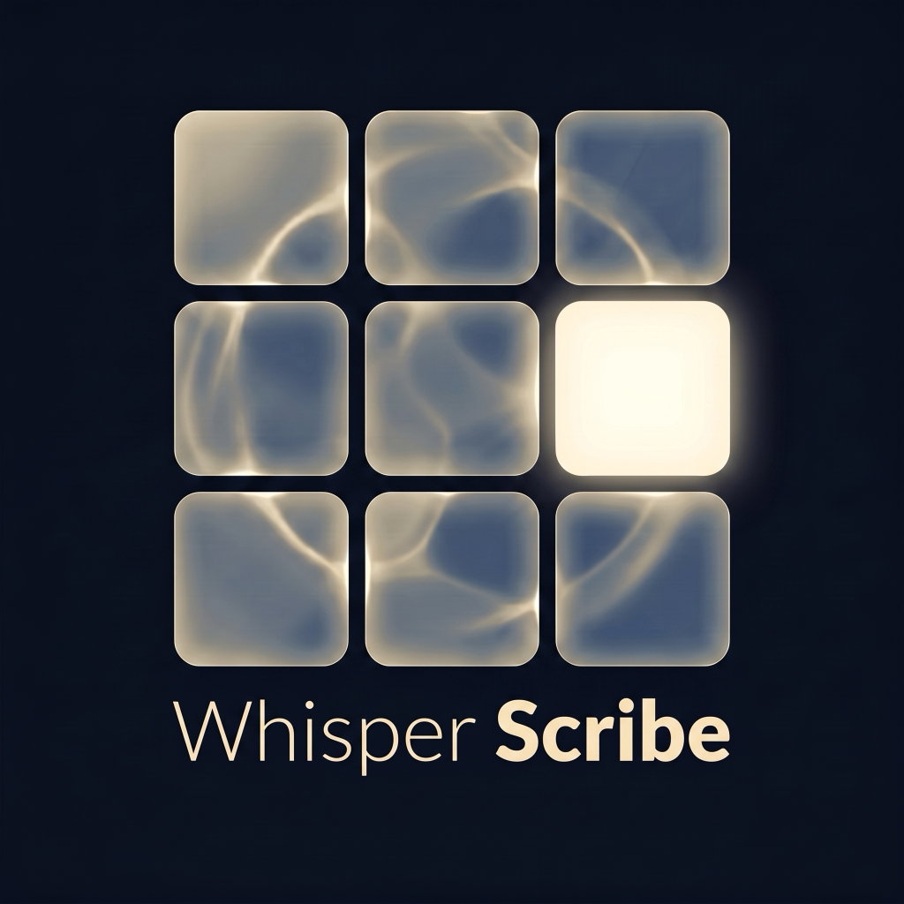
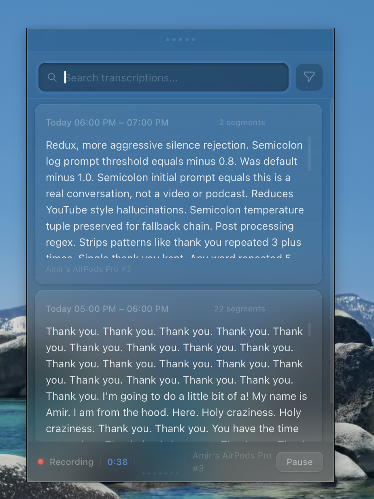
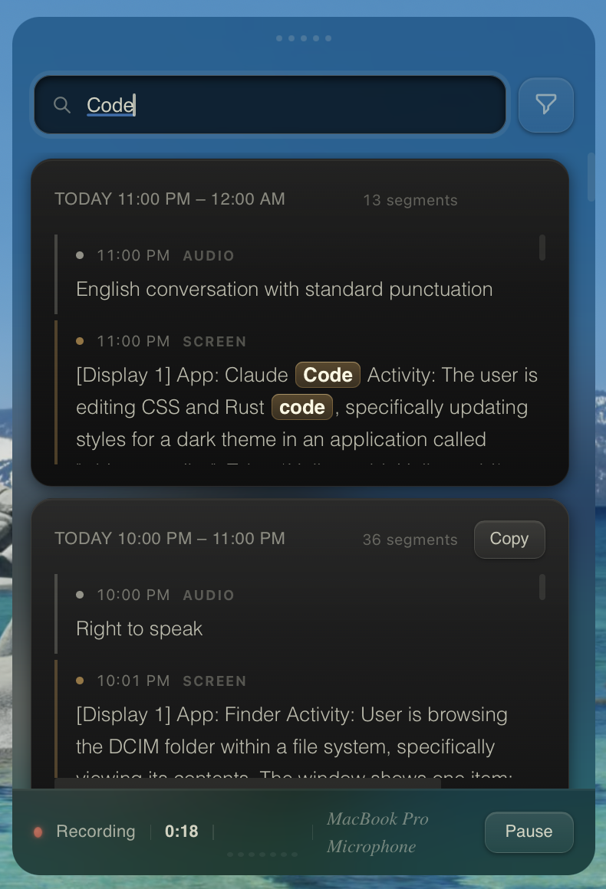
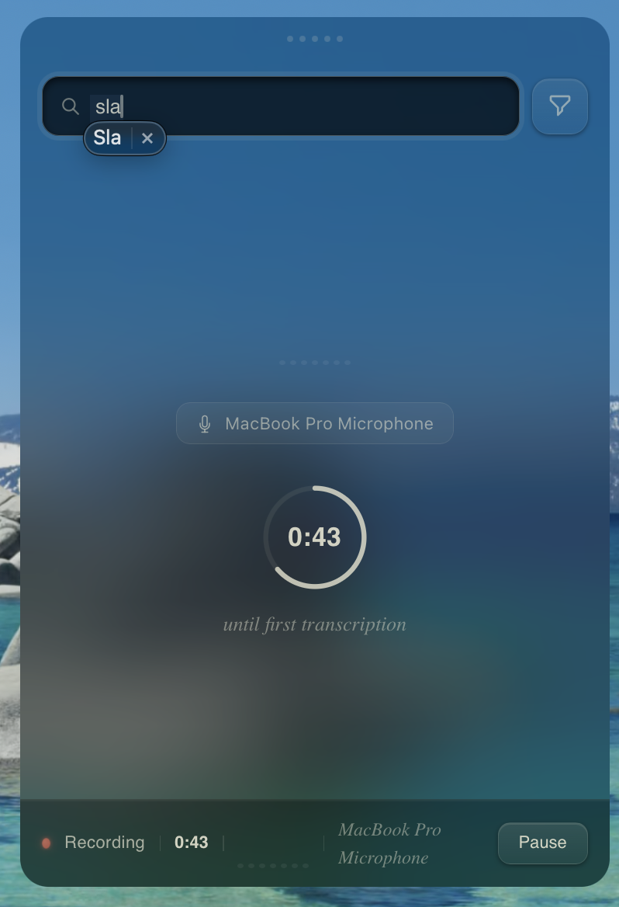
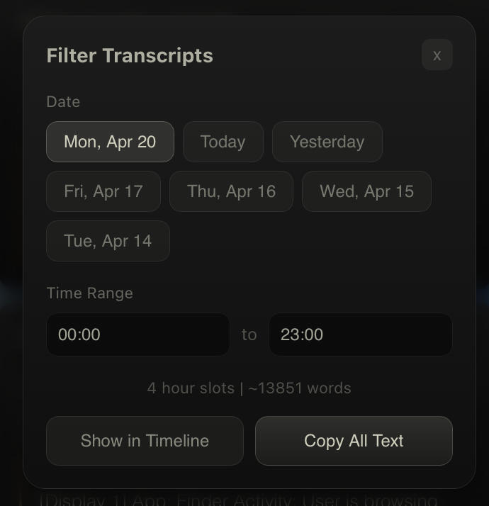

<p align="center">
  
</p>

# Whisper Scribe

A fast, lightweight macOS menu bar app that continuously records audio and transcribes it locally using Whisper Large v3 on Apple Silicon GPU. Periodically captures screenshots and analyzes them with a local vision model for screen context logging. Everything stays on-device — no cloud, no subscriptions.

<p align="center">
  
  
</p>

<p align="center">
  
  
</p>

## What It Does

Whisper Scribe sits in your menu bar and records audio in 2-minute segments, transcribing each one with MLX-accelerated Whisper Large v3. Every 5 minutes, it captures screenshots of all connected displays and analyzes them with Qwen3.5-9B (a local vision model on Apple Silicon GPU).

Both transcriptions and screen context appear in a unified chronological timeline — one card per clock hour, segments interleaved by timestamp. Audio segments and screen context segments are visually distinguished with colored markers. All text is stored locally in SQLite with full-text search, date filtering, and time range selection.

## Key Features

- **Always-on recording** with smart pause on screen lock/sleep
- **MLX GPU transcription** via Whisper Large v3 (~2x faster than CPU on M-series chips)
- **Unified timeline** — audio and screen context interleaved chronologically per hour
- **Full-text search** with highlighted results and tag-based filtering
- **Date/time filtering** — filter by day and hour range, copy all matching text
- **Expanded detail view** — double-click any hour card for a resizable modal with full content
- **Hallucination filtering** — Silero VAD pre-filter + post-processing regex strips repeated phrases and silent-segment artifacts
- **Smart device selection** — auto-prefers built-in mic over Bluetooth to avoid AirPods audio degradation
- **macOS native** — translucent vibrancy with liquid glass aesthetic, draggable window
- **Screen context logging** — periodic screenshot capture + on-device OCR via Qwen3.5-9B vision model
- **Multi-monitor support** — captures all connected displays via CoreGraphics
- **Privacy-first screen capture** — no screencapture CLI, direct CoreGraphics FFI, permission checked before every cycle

## Tech Stack

Rust (Tauri v2) + SolidJS + MLX Whisper + MLX-VLM/Qwen3.5 (Python) + SQLite FTS5 + CoreGraphics

## Requirements

- macOS 14+ on Apple Silicon (M1/M2/M3/M4)
- Python 3.11+ (mlx-whisper and mlx-vlm auto-install on first run)
- ~3 GB disk for Whisper Large v3 MLX model (downloads automatically)
- ~6 GB disk for Qwen3.5-9B-MLX-4bit vision model (downloads automatically)
- Screen Recording permission (prompted on first capture)

## Install

```bash
# Build from source
npm install
cargo tauri build

# The .app and .dmg are in src-tauri/target/release/bundle/
cp -R "src-tauri/target/release/bundle/macos/Whisper Scribe.app" /Applications/
```

## Roadmap

- [x] Periodic screen capture with local vision model (Qwen3.5-9B) for OCR-based activity logging
- [x] Searchable visual history — what you saw + what you said, correlated by timestamp
- [x] Multi-monitor screenshot support
- [ ] Speaker diarization (who said what)
- [ ] Export to markdown/JSON
